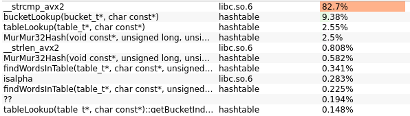
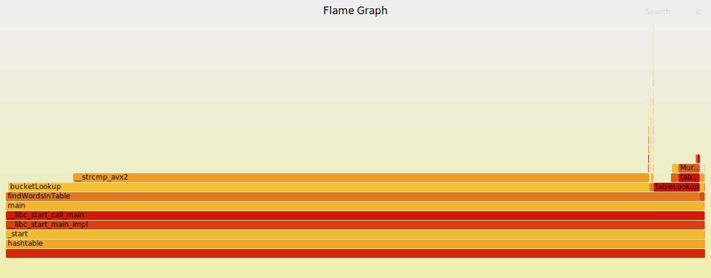

# Optimized hash table

Hash table optimized by using 3 methods:
1. Intrinsics.
2. Inline assembler
3. Assembler

## First version

Successfully found 95630230 words out of 10000000
finding lasted 56106.864700 ms

## strcmp() optimization

### SSE optimizations:

Successfully found 95630230 words out of 10000000
finding lasted 46120.426100 ms

### all words support, check for length:

Successfully found 95630230 words out of 10000000
finding lasted 45449.313700 ms

Successfully found 95630230 words out of 10000000
finding lasted 43817.687000 ms

## different hash function (crc32)
Successfully found 95630230 words out of 10000000
finding lasted 27232.996300 ms

Successfully found 95630230 words out of 10000000
finding lasted 30144.921800 ms

### inligned

Successfully found 95630230 words out of 10000000
finding lasted 26482.548000 ms

Successfully found 95630230 words out of 10000000
finding lasted 26542.689400 ms

Successfully found 95630230 words out of 10000000
finding lasted 26542.172600 ms

Successfully found 95630230 words out of 10000000
finding lasted 26769.209800 ms

### avx
Successfully found 95630230 words out of 10000000
finding lasted 27277.673300 ms

Successfully found 95630230 words out of 10000000
finding lasted 27526.831500 ms

Successfully found 95630230 words out of 10000000
finding lasted 27651.796700 ms
