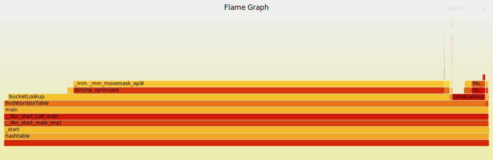

# Оптимизированная хэш-таблица

## Что такое хэш-таблица?
Хэш-таблица — структура данных для эффективного хранения пар **ключ-значение**.
**Принцип работы**: ключи преобразуются в индексы через хэш-функцию, таким образом определяется номер бакета (bucket), в котором будет происходить линейный поиск.

Преимущества такого подхода - быстрые поиск и вставка - **O(1)** (в идеальном случае)

---

## Особенности эксперимента

**Эксперимент** заключается в оптимизации поиска в хэш-таблице.

Одной из ключевой особенностей эксперимента является сильно повышенный **load factor - 15.04**, когда в нормальных условиях он обычно не превышает 1.5. Это сделано в образовательных целях для увеличения возможностей для оптимизации.

**Основная цель эксперимента** - добиться улучшения производительности при поиске элементов в таблице, используя, в том числе, 3 метода машинно-зависимых оптимизаций:
1. Интринсики (intrinsics)
2. Инлайн ассемблер
3. Ассемблер (в другом файле)

Также в ходе работы были проделаны машинно-независимые оптимизации, связанные, в основном, с увеличением эффективности использования кэша процессора.

---

### Условия эксперимента

#### Данные в таблице

В таблицу загружаются слова из файла [`shakespeare.txt`](test_data/shakespeare.txt) (30779 уникальных слов)

#### Данные для поиска

Для данных для поиска генерируется файл, в котором случайным образом выбирается 5 млн. слов из [`shakespeare.txt`](test_data/shakespeare.txt) и 5 млн. слов из [`war-and-peace.txt`](test_data/war-and-peace.txt). То есть суммарный файл состоит из 10 млн. строк

#### Поиск

Файл для поиска прогоняется десять раз. То есть суммарное количество запросов поиска - 100 млн.

---

### Метрики производительности

Параметры компиляции при замере времени:

```bash
g++ -g -masm=intel -march=native -DNDEBUG -I./$(HEADDIR) -O3 ...
```

Для измерения среднего времени 100 млн. запросов поиска использовалась стандартная функция `clock_gettime()` с параметром `CLOCK_PROCESS_CPUTIME_ID`.

Для каждого состояния измерения проводились 5 раз. Считалось среднее время и стандартное отклонение.

---

### Профилирование

#### Особенности компиляции
Параметры компиляции при профилировании:

```bash
g++ -g -masm=intel -march=native -DNDEBUG -I./$(HEADDIR) -O3 -fno-omit-frame-pointer -fno-optimize-sibling-calls -fno-inline ...
```

Параметры `-fno-omit-frame-pointer`, `-fno-optimize-sibling-calls` и `-fno-inline` помогают правильнее строить call tree. На практике они замедляют программу примерно на 10%. Будем считать, что они не сильно влияют на ключевое распределение времени между функциями благодаря чему мы можем доверять данным профилирования.

#### Способ профилирования

Профилирование будем осуществлять с помощью инструмента `perf`. Для наглядности будем строить flame graph при помощи [`FlameGraph`](https://github.com/brendangregg/FlameGraph).

Также будем использовать GUI для perf [`Hotspot`](https://github.com/KDAB/hotspot).

---


## Базовая версия

Самая "наивная" версия.

В базовой версии в качестве хэш-функции используется **MurMur32**. Каждый bucket является односвязным списком, в котором каждый новый элемент аллоцируется с помощью `calloc()`.

| Время выполнения      | Относительное ускорение | Суммарное ускорение |
|-----------------------|-------------------------|---------------------|
| 56106.86 ± 0 мс       | 1.00x                   | 1.00x               |


*Базовая версия: доля времени функций*


*Базовая версия: Flame Graph*

Мы прекрасно видим, что наибольшее время занимает `__strcmp_avx2()`, что является одной из имплементаций фунции `strcmp()` стандартной библиотеки. У нас она используется в `bucketLookup()` - функции, осуществляющей линейный поиск в рамках одного бакета.

Поэтому следующий шаг - попытка оптимизировать сравнение строк

---

## Оптимизация сравнения строк
### SSE-векторизация strcmp()

В нашем сценарии использования большинство слов имеют длину меньше 16, доля слов с длиной больше 15 составляет порядка 1%. Таким образом, маленькие слова очень удобно помещать в xmm регистры и сравнивать их между собой. Было решено для этих целей использовать интринсики. Так выглядит функция сравнения двух таких малых строк:

```cpp
static inline int strcmp_optimized(__m128i str1, __m128i str2)
{
    __m128i cmp_result = _mm_cmpeq_epi8(str1, str2);

    uint32_t answer = (uint32_t)_mm_movemask_epi8(cmp_result);

    // we need to negate younger 16 bits
    answer ^= 0x0000FFFF;

    return answer;
}
```

| Время выполнения      | Относительное ускорение | Суммарное ускорение |
|-----------------------|-------------------------|---------------------|
| 45162.48 ± 2286 мс    | 1.24x                   | 1.24x               |

### Предварительная проверка длины

Так как нам в любом случае требуются длины двух строк, нам почти ничего не стоит сравнивать длины перед сравнением самих строк. Это также дало небольшой прирост производительности.

| Время выполнения      | Относительное ускорение | Суммарное ускорение |
|-----------------------|-------------------------|---------------------|
| 43817.69 ± 832 мс     | 1.03x                   | 1.28x               |


*Оптимизация strcmp: доля времени функций*


*Оптимизация strcmp: Flame Graph*


---

## Смена хэш-функции
### CRC32 с аппаратным ускорением


| Время выполнения      | Относительное ускорение | Суммарное ускорение |
|-----------------------|-------------------------|---------------------|
| 27232.99 ± 1456 мс    | 1.61x                   | 2.06x               |

### Инлайнинг CRC32


| Время выполнения      | Относительное ускорение | Суммарное ускорение |
|-----------------------|-------------------------|---------------------|
| 26542.30 ± 143 мс     | 1.03x                   | 2.12x               |

---

## Оптимизация структур данных
### Улучшение локальности элементов


| Время выполнения      | Относительное ускорение | Суммарное ускорение |
|-----------------------|-------------------------|---------------------|
| 11955.24 ± 30 мс      | 2.22x                   | 4.69x               |

### Замена списка на массив


| Время выполнения      | Относительное ускорение | Суммарное ускорение |
|-----------------------|-------------------------|---------------------|
| 5241.30 ± 25 мс       | 2.28x                   | 10.70x              |

---

## Низкоуровневые оптимизации
### 8-байтовое выравнивание


| Время выполнения      | Относительное ускорение | Суммарное ускорение |
|-----------------------|-------------------------|---------------------|
| 4950.21 ± 18 мс       | 1.06x                   | 11.33x              |

### 8-байтовая CRC32


| Время выполнения      | Относительное ускорение | Суммарное ускорение |
|-----------------------|-------------------------|---------------------|
| 4442.26 ± 33 мс       | 1.11x                   | 12.63x              |

---

## Финальные улучшения
### Оптимизация поиска в бакете


| Время выполнения      | Относительное ускорение | Суммарное ускорение |
|-----------------------|-------------------------|---------------------|
| 3738.80 ± 18 мс       | 1.19x                   | 15.01x              |

### Векторизация strlen


| Время выполнения      | Относительное ускорение | Суммарное ускорение |
|-----------------------|-------------------------|---------------------|
| 3583.80 ± 14 мс       | 1.04x                   | 15.65x              |

---

## Итоговые результаты
| Версия                | Время выполнения | Суммарное ускорение |
|-----------------------|------------------|---------------------|
| Начальная реализация  | 56106.86 мс      | 1.00x               |
| После всех оптимизаций | 3583.80 мс       | 15.65x              |

**Общее ускорение: 15.65×**
**Сокращение времени: 56.1 сек → 3.58 сек**
