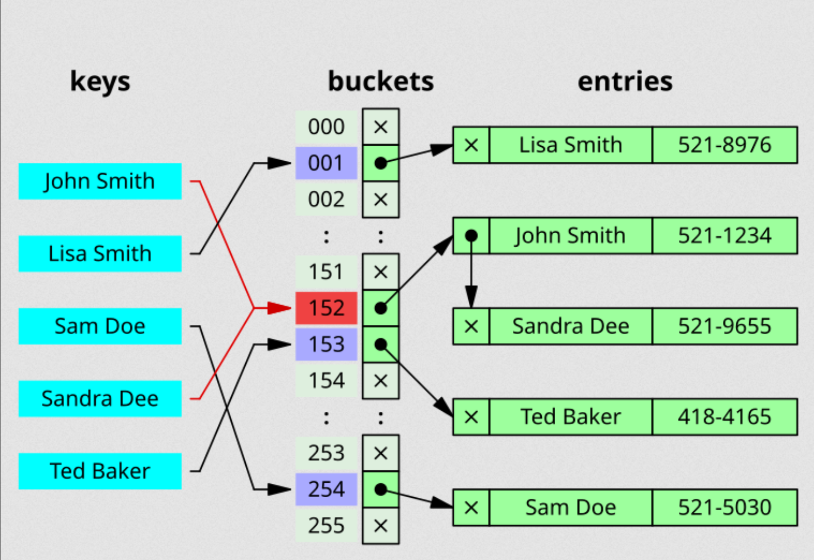
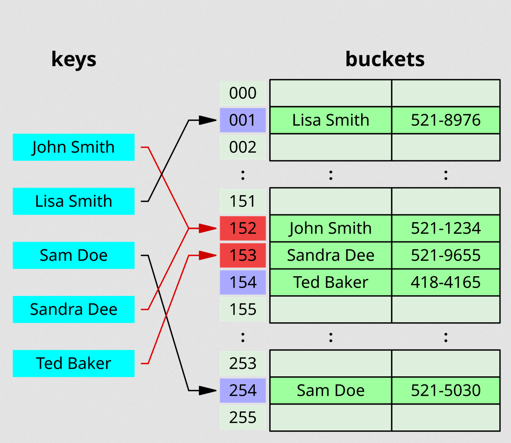
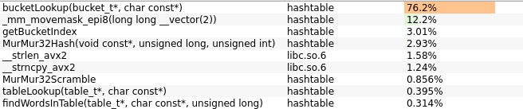
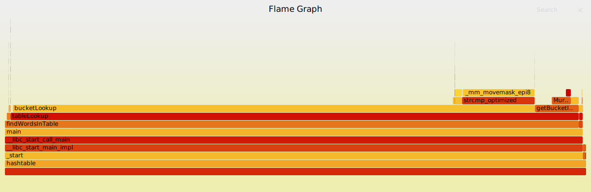
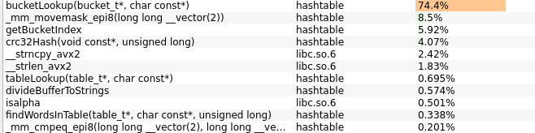
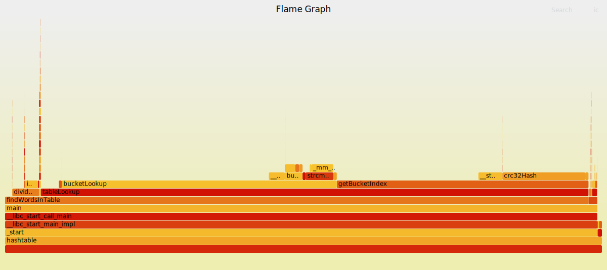

# Оптимизированная хэш-таблица

## Что такое хэш-таблица?
Хэш-таблица — структура данных для эффективного хранения пар **ключ-значение**.

**Принцип работы**:

1. Ключ преобразуется в числовой индекс с помощью хэш-функции
2. Используя найденный числовой индекс, находится нужный элемент
3. С найденным элементом проделываются необходимые операции - чтение/вставка/удаление

Преимущества такого подхода - быстрые поиск и вставка - **O(1)** (в идеальном случае).

Но возникает проблема **коллизий** - несколько ключей могут в результате иметь один и тот же индекс.

### Способы разрешения коллизий

Самыми распространнеными являются два способа - **метод цепочек** и **открытая адресация**.

#### Метод цепочек (Separate chaining)

В этом случае через хэш находится номер бакета, каждый из которых обычно является связным списком. Это делается, например, делением хэша по модулю количества бакетов. Далее для нахождения нужного элемента происходит линейный поиск по этому списку.

<!--  -->


<center>

*Решение коллизий методом цепочек. Источник: [wikipedia.org](https://en.wikipedia.org/wiki/Hash_table)*
</center>

#### Открытая адресация (Open addressing)

Здесь каждый бакет содержит лишь один элемент. В случае коллизии происходит поиск нужного бакета (или свободного места в случае вставки) по массиву бакетов. Для поиска применяют разные методы **пробирования**:

1. *Линейное пробирование* - интервал между пробами фиксированный (обычно 1)
2. *Квадратичное пробирование* - интервал между пробами увеличивается линейно
3. *Двойное хэширование* - интервал между пробами считается второй хэш-функцией

<!--  -->

<center>

*Решение коллизий открытой адресацией. Источник: [wikipedia.org](https://en.wikipedia.org/wiki/Hash_table)*
</center>

Для нашей таблицы выберем **метод цепочек**, так как нам нужен сильно увеличенный load factor, а открытая адресация не позволяет увеличить его выше 1.0.

---

## Особенности эксперимента

**Эксперимент** заключается в оптимизации поиска в хэш-таблице.

Одной из ключевой особенностей эксперимента является сильно повышенный **load factor - 15.04**, когда в нормальных условиях он обычно не превышает 1.5. Это сделано в образовательных целях для увеличения возможностей для оптимизации.

**Основная цель эксперимента** - добиться улучшения производительности при поиске элементов в таблице, используя, в том числе, 3 метода машинно-зависимых оптимизаций:
1. Интринсики (intrinsics)
2. Инлайн ассемблер
3. Ассемблер (в другом файле)

Также в ходе работы были проделаны машинно-независимые оптимизации, связанные, в основном, с увеличением эффективности использования кэша процессора.

---

### Условия эксперимента

#### Данные в таблице

В таблицу загружаются слова из файла [`shakespeare.txt`](test_data/shakespeare.txt) (30779 уникальных слов)

#### Данные для поиска

Для данных для поиска генерируется файл, в котором случайным образом выбирается 5 млн. слов из [`shakespeare.txt`](test_data/shakespeare.txt) и 5 млн. слов из [`war-and-peace.txt`](test_data/war-and-peace.txt). То есть суммарный файл состоит из 10 млн. строк

#### Поиск

Файл для поиска прогоняется десять раз. То есть суммарное количество запросов поиска - 100 млн.

---

### Метрики производительности

Время исполнения замерялось на устройстве с процессором **Intel Core i5-8250U - 4 ядра, 1.6 GHz**.

Параметры компиляции при замере времени:

```bash
g++ -g -masm=intel -march=native -DNDEBUG -I./$(HEADDIR) -O3 ...
```

Для измерения среднего времени 100 млн. запросов поиска использовалась стандартная функция `clock_gettime()` с параметром `CLOCK_PROCESS_CPUTIME_ID`.

Для каждого состояния измерения проводились 5 раз. Считалось среднее время и стандартное отклонение.

#### Расчеты

Среднее время оценивается как обычное среднее арифметическое. Погрешность оценивается как среднеквадратичное отклонение по формуле:

```math
\sigma = \sqrt{\frac{N}{N-1}(\overline {x ^ 2} - \overline {x} ^ 2)}
```

*Относительное ускорение* - отношение предыдущего времени выполнения к настоящему.

*Суммарное ускорение* - отношение начального времени к настоящему времени.

---

### Профилирование

#### Особенности компиляции
Параметры компиляции при профилировании:

```bash
g++ -g -masm=intel -march=native -DNDEBUG -I./$(HEADDIR) -O3 -fno-omit-frame-pointer -fno-optimize-sibling-calls -fno-inline ...
```

Параметры `-fno-omit-frame-pointer`, `-fno-optimize-sibling-calls` и `-fno-inline` помогают правильнее строить call tree. На практике они замедляют программу примерно на 10%. Будем считать, что они не сильно влияют на ключевое распределение времени между функциями, благодаря чему мы можем доверять данным профилирования.

#### Способ профилирования

Профилирование будем осуществлять с помощью инструмента `perf`. Для наглядности будем строить flame graph при помощи [`FlameGraph`](https://github.com/brendangregg/FlameGraph).

Также будем использовать GUI для perf [`Hotspot`](https://github.com/KDAB/hotspot).

На всех скриншотах в процентах указано собственное время функции, не включая время вызываемых ею функций.

---


## Базовая версия

Самая "наивная" версия.

В базовой версии в качестве хэш-функции используется **MurMur32**. Каждый bucket является односвязным списком, в котором каждый новый элемент аллоцируется с помощью `calloc()`.

| Время выполнения      | Относительное ускорение | Суммарное ускорение |
|-----------------------|-------------------------|---------------------|
| 56140 ± 130 мс        | 1.00x                   | 1.00x               |


*Базовая версия: доля времени функций*


*Базовая версия: Flame Graph*

Мы прекрасно видим, что наибольшее время занимает `__strcmp_avx2()`, что является одной из имплементаций фунции `strcmp()` стандартной библиотеки. У нас она используется в `bucketLookup()` - функции, осуществляющей линейный поиск в рамках одного бакета.

Поэтому следующий шаг - попытка оптимизировать сравнение строк.

---

## Оптимизация сравнения строк
### Оптимизация strcmp()

В нашем сценарии использования большинство слов имеют длину меньше 16, доля слов с длиной большей или равной  16 составляет порядка 1%. Такие маленькие слова очень удобно помещать в xmm регистры и сравнивать их между собой, используя SSE инструкции. Было решено для этих целей использовать интринсики. Так выглядит функция сравнения двух таких малых строк:

```cpp
static inline int strcmp_optimized(__m128i str1, __m128i str2)
{
    __m128i cmp_result = _mm_cmpeq_epi8(str1, str2);

    uint32_t answer = (uint32_t)_mm_movemask_epi8(cmp_result);

    // we need to negate lower 16 bits
    answer ^= 0x0000FFFF;

    return answer;
}
```

| Время выполнения      | Относительное ускорение | Суммарное ускорение |
|-----------------------|-------------------------|---------------------|
| 45162 ± 95 мс         | 1.24x                   | 1.24x               |

### Предварительная проверка длины

Так как нам в любом случае требуются длины двух строк, нам почти ничего не стоит сравнивать длины перед сравнением самих строк. Это также дало небольшой прирост производительности.

| Время выполнения      | Относительное ускорение | Суммарное ускорение |
|-----------------------|-------------------------|---------------------|
| 42470 ± 190 мс        | 1.06x                   | 1.32x               |




*Оптимизация strcmp: доля времени функций*



*Оптимизация strcmp: Flame Graph*

---

## Смена хэш-функции
### Использование CRC32

На данном этапе для будущих оптимизаций было решено сменить хэш-функцию. Вместо MurMur32 теперь CRC32. Хотя подсчет хэша занимал всего 3% общего времени исполнения, неожиданно было получено ускорение примерно на 60%. Скорее всего, это связано с некорректной работой предыдущей функции хэширования, вследствие чего после ее замены распределение элементов по бакетам значительно улучшилось.

| Время выполнения      | Относительное ускорение | Суммарное ускорение |
|-----------------------|-------------------------|---------------------|
| 26585 ± 125 мс        | 1.60x                   | 2.11x               |



*Замена хэш-функции: доли времени функций*

<!-- 

*Замена хэш-функции: Flame Graph* -->

---

## Оптимизация структур данных
### Улучшение локальности элементов

Теперь стало понятно, что наибольшее время в нашем сценарии использования хэш-таблицы занимает функция `bucketLookup()`. Вот самый горячий элемент функции:

```cpp
__m128i aligned_name = _mm_set1_epi32(0);
memcpy((char *)&aligned_name, name, name_len);

elem_t * next_elem = bucket->first_elem;

while (next_elem != NULL){
    elem_t * cur_elem = next_elem;
    next_elem = cur_elem->next;

    if (strcmp_optimized(cur_elem->short_name, aligned_name) == 0)
        return cur_elem->data;
}
```

Во время поиска идет последовательное обращение к элементам списка. Попробуем улучшить локальность - теперь элементы будут лежать друг за другом, будем вызывать один `calloc()` сразу на все элементы одного бакета.

Как и ожидалось, это увеличило производительность благодаря более эффективному использованию кеша процессора. Код `bucketLookup()` в этом случае не поменялся.


| Время выполнения      | Относительное ускорение | Суммарное ускорение |
|-----------------------|-------------------------|---------------------|
| 10429 ± 27 мс         | 2.55x                   | 5.38x               |

### Замена списка на массив

Теперь элементы лежат последовательно. Наша хэш-таблица не поддерживает удаление элементов, добавление происходит только в самом начале в момент загрузки данных в таблицу. Выходит, что мы смело можем заменить наш список на обычный массив, обращаясь к элементам поочередно.

Теперь самое горячее место `bucketLookup()` выглядит следующим образом:

```cpp
__m128i aligned_name = _mm_set1_epi32(0);
memcpy((char *)&aligned_name, name, name_len);

elem_t * cur_elem = bucket->elements;

// bucket->elements is just an array
for (size_t elem_index = 0; elem_index < bucket_size; elem_index++){
    if (strcmp_optimized(cur_elem->short_name, aligned_name) == 0)
        return cur_elem->data;

    cur_elem++;
}
```

Благодаря отсутствию необходимости обращаться к памяти за адресом следующего элемента было было получено значительное ускорение.

| Время выполнения      | Относительное ускорение | Суммарное ускорение |
|-----------------------|-------------------------|---------------------|
| 5259 ± 24 мс          | 1.98x                   | 10.68x              |


Таким образом, оптимизировав структуры данных мы получили относительное ускорение **в 5.06 раз**.

---

## Оптимизации хэш-функции

Взглянем на текущее распределение времени и Flame Graph:


*После замены списка на массив: доли времени функций*



*После замены списка на массив: Flame Graph*

Заметим, что на втором месте после `bucketLookup()` идет функция `getBucketIndex()`, но она включает в себя функцию на третьем месте - `crc32Hash()`.

Функция `getBucketIndex()` довольно проста:

```cpp
static size_t getBucketIndex(table_t * table, const char * name)
{
    size_t table_size = table->table_size;

    uint32_t hash = crc32Hash(name, strlen(name));
    size_t index = hash % table_size;

    return index;
}
```

Поэтому предлагается оптимизировать именно `crc32Hash()`.

### 1-байтовый CRC32

В x86_64 существует инструкция `crc32`, которую можно использовать для оптимизации хэш-функции. Она существует в нескольких вариациях и позволяет считать хэш как для каждого байта отдельно, так и блоками по 4 и 8 байт. Чтобы ей воспользоваться, перепишем функцию подсчета хэша на ассемблере.

Для начала напишем версию с 1-байтовой инструкцией `CRC32`:

```asm
; crc32_optimized(const void * data, const size_t len)
;   rdi = data ptr
;   rsi = data len
crc32_optimized:
        mov eax, 0xFFFFFFFF     ; hash = 0xFFFFFFFF
        mov rcx, rsi            ; rcx  = len

    .hash_loop:
        crc32 eax, BYTE [rdi]
        inc rdi

        loop .hash_loop

        xor eax, 0xFFFFFFFF
ret
```

Используя ее удалось получить ускорение:

| Время выполнения      | Относительное ускорение | Суммарное ускорение |
|-----------------------|-------------------------|---------------------|
| 5015 ± 34 мс          | 1.05x                   | 11.19x              |


### 8-байтовая CRC32

Попробуем использовать 8-байтовую версию инструкции `CRC32`.

Но для более легкого внедрения этой инструкции в нашу программу, нам требуется выравнивание данных, кратное 8. Для дальнейших оптимизаций сразу будем использовать выранивание, кратное 16.

Итак, версия функции с 8-байтовой инструкцией `CRC32`:

```asm
; crc32_optimized_8byte(const void * data, const size_t len);
;   rdi = data ptr MUST BE ALIGNED TO 8
;   rsi = data len
crc32_optimized_8byte:
        add rsi, 7
        shr rsi, 3              ; divide by 8 rounding upward

        mov eax, 0xFFFFFFFF     ; hash = 0xFFFFFFFF

        mov rcx, rsi            ; rcx = len / 8 (round upward)

    .hash_loop:
        crc32 rax, QWORD [rdi]
        add rdi, 8

        loop .hash_loop

        xor eax, 0xFFFFFFFF
ret
```

Как и ожидалось, 8-байтовая версия значительно быстрее 1-байтовой:

| Время выполнения      | Относительное ускорение | Суммарное ускорение |
|-----------------------|-------------------------|---------------------|
| 4461 ± 26 мс          | 1.12x                   | 12.58x              |

Итого аппаратно-зависимые оптимизации хэш-функции дали ускорение **в 1.18 раза**.

---

## Финальные оптимизации
### Оптимизация поиска в бакете

Посмотрим, что еще можно оптимизировать. Несмотря на все старания, **Hotspot** не хочет правильно отображать имя `crc32_optimized_8byte()`, поэтому далее будем смотреть распределение времени функций в **perf report** (с параметром --no-children):


*8-байтовый CRC32: доли времени функций*

Подсчет CRC32 теперь занимает порядка 3.6% времени, но немалую долю занимает `__memmove_avx_unaligned_erms()`. Это часть стандартной функции memcpy, она в данный момент используется в `bucketLookup()`, чтобы скопировать невыровненный ключ в выровненную область памяти для дальнейших операций:

```cpp
__m128i aligned_name = _mm_set1_epi32(0);
memcpy(&aligned_name, name, name_len);
```

Но ведь мы сделали выравнивание 16 для всех ключей, когда оптимизировали хэш-функцию. Получается, что такое копирование излишне. Приведенный фрагмент заменим на:

```cpp
__m128i aligned_name = _mm_load_si128((__m128i *)name);
```

Будем считать такую оптимизацию частью оптимизации сравнения строк, поскольку она уменьшила издержки, возникающие при приготовлении данных для сравнения с помощью SSE инструкций.

Такая оптимизация дала неплохой прирост скорости выполнения:

| Время выполнения      | Относительное ускорение | Суммарное ускорение |
|-----------------------|-------------------------|---------------------|
|  3742 ± 16 мс         | 1.19x                   | 15.00x              |


*Оптимизация поиска: доли времени функций*

### Оптимизация strlen

Как мы видим, теперь немалую долю (а именно, 9.14%) занимает стандартная функция `strlen()`. По сравнению со стандартной библиотекой у нас есть преимущество - мы знаем, что все строки лежат с выравниванием 16 байт. Это дает нам возможность написать оптимизированную версию strlen, используя инлайн ассемблер:

```cpp
static inline size_t strlen_optimized(const char * str)
{
    const char * cur_char = str;

    asm("pxor xmm0, xmm0 \n\t"  // xmm0 is all zeros
        : : : "xmm0"
    );

    uint32_t mask = 0;

    while (! ending){
        asm("movdqa xmm1, [%[cur_char]] \n\t"
            "pcmpeqb xmm1, xmm0         \n\t"
            "pmovmskb %[mask], xmm1   \n\t"
            // mask`s bit i is 1 if cur_block[i] = 0

            : [mask]   "=r" (mask)
            : [cur_char] "r" (cur_char)
            : "xmm1"
        );

        cur_char += 16;
    }

    uint32_t shift = 0;

    asm (
        "bsf %[shift], %[mask] \n\t"
        : [shift]  "=r" (shift)
        : [mask] "r"  (mask)
    );
    size_t len = (cur_char - str) - 16 + shift;

    return len;
}
```

Использование такой функции вместо стандартного `strlen()` также дало прирост производительности:

| Время выполнения      | Относительное ускорение | Суммарное ускорение |
|-----------------------|-------------------------|---------------------|
| 3590 ± 10 мс          | 1.04x                   | 15.64x              |

---

## Итоговые результаты

После всех оптимизаций распределение времени между функциями и Flame Graph выглядят следующим образом:


*Финал: доли времени функций*


*Финал: Flame Graph*

Использовались следующие аппаратно-зависимые оптимизации:

| Оптимизация                       |  Метод            |    Относительное ускорение    |
|-----------------------------------|-------------------|-------------------------------|
| Сравнение строк (strcmp)          |  интринсики       |       1.48x                   |
| Хэш-функция                       |  ассемблер        |       1.18x                   |
| Вычисление длины строки (strlen)  | инлайн ассемблер  |       1.04x                   |
| **Итого**                         |                   |     **1.82x**                 |

Оценка в 1.82x для аппаратно-зависимых оптимизаций очень груба - эти оптимизации были сделаны на разных этапах и были бы невозможны без изменения архитектуры программы. Тем не менее это число дает некоторое представление об эффективности такого рода оптимизаций.

Итоговое ускорение приведем в таблице:

| Версия                            |  Суммарное ускорение |
|-----------------------            |----------------------|
| Начальная реализация              |  1.00x               |
| Аппаратно-зависимые оптимизации   |  1.82x               |
| **После всех оптимизаций**        | **15.64x**           |

**Общее ускорение: 15.64x**

**Сокращение времени: 56.1 сек -> 3.59 сек**
